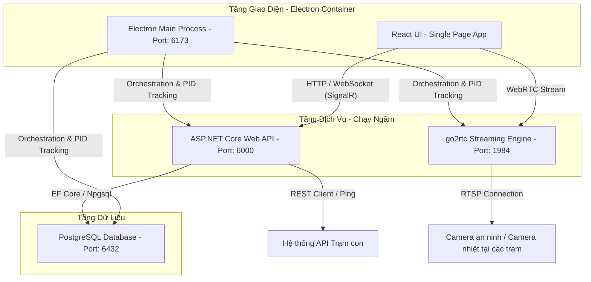

# HỒ SƠ KỸ THUẬT CHI TIẾT DỰ ÁN
## HỆ THỐNG GIÁM SÁT TRUNG TÂM (STATIONOS - MASTER STATION)
### PHIÊN BẢN: v3.0.13

---

> [!IMPORTANT]
> Bộ hồ sơ kỹ thuật chi tiết này được thiết lập nhằm chứng minh quy trình sản xuất phần mềm khép kín từ khâu khảo sát đến bàn giao của dự án **StationOS - Master Station (Phiên bản v3.0.13)**. Tài liệu này đóng vai trò là chứng từ chứng minh hoạt động sản xuất phần mềm phục vụ lưu trữ, kiểm toán và báo cáo thuế của doanh nghiệp.

---

## I. CÔNG ĐOẠN KHẢO SÁT & XÁC ĐỊNH YÊU CẦU

### 1. Phiếu khảo sát yêu cầu khách hàng
* **Đơn vị yêu cầu**: Các Công ty Điện lực Thành phố/Tỉnh trực thuộc Tổng công ty, phòng điều khiển trung tâm SCADA và các tổ thao tác lưu động.
* **Thời gian khảo sát**: Tháng 05/2026.
* **Hiện trạng & Khó khăn tại các trạm**:
  * Các trạm biến áp, trạm phân phối điện năng (trạm con) phân tán trên diện rộng. Dữ liệu giám sát nhiệt độ thiết bị ngoại vi, phóng điện cục bộ (PD) tủ trung thế, và luồng camera an ninh hiện tại chỉ lưu trữ cục bộ, không thể giám sát tập trung gây khó khăn cho việc quản lý cấp tổng công ty.
  * Việc đo đạc thủ công hoặc kiểm tra định kỳ tại trạm tốn kém thời gian và nhân lực. Cần một giải pháp trạm tổng để hợp nhất toàn bộ dữ liệu đo đạc thời gian thực từ các trạm con về phòng điều khiển trung tâm qua mạng WAN nội bộ.
  * Hạ tầng máy chủ tại trung tâm vận hành đồng thời nhiều hệ thống. Khi cài đặt phần mềm Master Station trên cùng máy chủ vật lý đang chạy ứng dụng Trạm con (Sub-station), thường xuyên xảy ra xung đột cổng mạng (Port Collision) và tiến trình ngầm (như PostgreSQL hoặc API Backend bị tắt chéo). 
  * Giao diện bản đồ GIS giám sát đa điểm (Multisite Map View) thi thoảng bị lỗi xám một phần khung hình khi người dùng chuyển hướng nhanh giữa trang Quản lý License và trang Dashboard chính, làm giảm hiệu quả giám sát liên tục.

### 2. Tài liệu đặc tả yêu cầu hệ thống (SRS - Software Requirement Specification)
Tài liệu này xác định chi tiết các chức năng hệ thống cung cấp:

#### 2.1. Yêu cầu chức năng (Functional Requirements)
* **G1. Bản đồ giám sát đa trạm GIS tập trung (Multisite Map View)**:
  * Tải bản đồ số GIS trực tuyến hoặc ngoại tuyến, hiển thị tọa độ địa lý chính xác của tất cả các trạm con.
  * Hiển thị trạng thái kết nối thời gian thực của trạm con thông qua mã màu (Màu xanh: Bình thường/Online; Màu đỏ: Có cảnh báo/Alarm; Màu xám: Mất kết nối/Offline).
  * Liên kết nhanh: Click vào trạm con trên bản đồ sẽ mở popover thông tin chi tiết và cung cấp link truy cập trực tiếp hệ thống của trạm đó.
* **G2. Hợp nhất luồng trực tuyến Camera trung tâm (Live Wall)**:
  * Tiếp nhận luồng RTSP camera (quang học thông thường, camera nhiệt đo nhiệt độ đầu cáp, camera phóng điện) từ các trạm con.
  * Giải mã và chuyển đổi luồng trung gian thông qua bộ chuyển mã `go2rtc` tích hợp sẵn trong bộ cài, truyền tải luồng WebRTC/MSE độ trễ cực thấp (dưới 500ms) để xem mượt mà trên trình duyệt/Electron client.
  * Thiết lập bảng lưới camera động (Live Wall) hỗ trợ xem đồng thời nhiều luồng camera từ nhiều trạm khác nhau trên cùng một màn hình điều khiển.
* **G3. Đồng bộ cảnh báo & Sự kiện thời gian thực (Centralized Alert Hub)**:
  * Tiếp nhận tự động các bản tin cảnh báo sự cố gửi lên từ trạm con thông qua API REST.
  * Đẩy thông báo cảnh báo tức thời lên giao diện Client bằng giao thức WebSocket (SignalR).
  * Hỗ trợ thanh điều khiển bên phải (Right Panel) để truy xuất nhanh danh sách cảnh báo mới nhất, phát âm thanh còi báo động khi có sự cố nghiêm trọng (Alarm Level).
* **G4. Phân cấp quản trị người dùng phức hợp (RBAC 4 tầng)**:
  * Hỗ trợ phân quyền chặt chẽ theo cấu trúc hình cây hành chính:
    * `Admin Toàn Cục (multi)`: Quản lý tối cao toàn bộ hệ thống, quản trị hạn ngạch license.
    * `Admin Tỉnh (provinceadmin)`: Chỉ thao tác và giám sát các Tổ thao tác và Trạm con trong phạm vi tỉnh được gán.
    * `Tổ Trưởng Tổ Thao Tác (teamleader)`: Giám sát và điều phối xử lý sự cố tại nhóm trạm thuộc tổ phụ trách.
    * `Admin Trạm (stationadmin)`: Quản trị cấu hình và phân công nhân sự cục bộ tại một trạm con cụ thể.
* **G5. Quản lý hạn ngạch bản quyền phần mềm (License Quota Management)**:
  * Mã hóa và giải mã file bản quyền chứa thông số hạn ngạch sử dụng thiết bị (Số lượng camera được phép giám sát, số lượng điểm đo cảm biến nhiệt độ tối đa).
  * Kiểm soát việc import/export license của trạm tổng và quản lý cấp quota xuống các trạm con trực thuộc.

#### 2.2. Yêu cầu phi chức năng (Non-Functional Requirements)
* **Hiệu năng & Khả năng xử lý song song**: Tối ưu hóa bộ nhớ và tài nguyên CPU. Khi chạy song song trên cùng một hệ điều hành với Trạm con, ứng dụng Master Station phải cách ly hoàn toàn tài nguyên cổng mạng và tiến trình dịch vụ.
* **Độ trễ dữ liệu**:
  * Thời gian phản hồi tín hiệu kết nối trạm con < 2 giây.
  * Độ trễ luồng truyền hình trực tiếp WebRTC < 500ms.
* **Dung lượng đóng gói**: Tối ưu hóa bộ cài đặt dưới 230 MB bằng cách dọn dẹp các tệp tin debug, symbols của PostgreSQL và thư mục tạm thời của Backend.

### 3. Biên bản phê duyệt yêu cầu khách hàng
* **Đại diện Khách hàng**: Ban Kỹ thuật An toàn & Công nghệ Thông tin - Tổng công ty Điện lực.
* **Đại diện Đơn vị Phát triển**: Trưởng dự án phát triển StationOS Master Station.
* **Nội dung thống nhất**: Phê duyệt các chức năng trên và đưa vào kế hoạch phân tích thiết kế, triển khai mã nguồn cho phiên bản ứng dụng v3.0.13.

---

## II. CÔNG ĐOẠN PHÂN TÍCH & THIẾT KẾ

### 1. Sơ đồ kiến trúc hệ thống (Architecture Diagram)
Hệ thống Master Station được đóng gói dưới dạng **Thick Client (All-in-One)**. Các cổng mạng dịch vụ được thiết lập độc lập so với Trạm con:



### 2. Sơ đồ cơ sở dữ liệu chi tiết (Database Schema)
Các bảng dữ liệu được thiết kế tối ưu trên PostgreSQL phục vụ quản lý tập trung:

#### Bảng `Users` (Thông tin tài khoản và phạm vi quản lý)
| Tên cột | Kiểu dữ liệu | Ràng buộc | Mô tả |
|---|---|---|---|
| `user_id` | `uuid` | Primary Key | Khóa chính |
| `username` | `varchar(100)` | Unique, Not Null | Tên đăng nhập hệ thống |
| `fullname` | `varchar(200)` | Not Null | Họ và tên đầy đủ |
| `email` | `varchar(150)` | Null | Địa chỉ thư điện tử |
| `role` | `varchar(50)` | Not Null | Vai trò (`admin`, `admin_province`, `operator_province`, `team_leader`...) |
| `active` | `boolean` | Not Null | Trạng thái kích hoạt tài khoản |
| `created_at` | `timestamp` | Not Null | Thời gian tạo tài khoản |
| `is_restricted`| `boolean` | Null | Bị giới hạn quyền truy cập |
| `station_ids` | `text` | Null | Danh sách trạm con được quản lý (JSON Array) |
| `province_ids` | `text` | Null | Danh sách tỉnh thành được quản lý (JSON Array) |
| `team_id` | `uuid` | Foreign Key | Liên kết tới bảng `Teams` |

#### Bảng `Provinces` (Danh mục Tỉnh thành quản lý)
| Tên cột | Kiểu dữ liệu | Ràng buộc | Mô tả |
|---|---|---|---|
| `id` | `uuid` | Primary Key | Khóa chính |
| `name` | `varchar(200)` | Not Null | Tên tỉnh thành (Ví dụ: `Long An`) |
| `code` | `varchar(50)` | Null | Mã tỉnh thành |
| `description` | `text` | Null | Mô tả chi tiết |
| `status` | `varchar(20)` | Not Null | Trạng thái (`active`/`inactive`) |
| `createdAt` | `timestamp` | Not Null | Thời gian khởi tạo |

#### Bảng `Teams` (Tổ thao tác lưu động hiện trường)
| Tên cột | Kiểu dữ liệu | Ràng buộc | Mô tả |
|---|---|---|---|
| `id` | `uuid` | Primary Key | Khóa chính |
| `name` | `varchar(150)` | Not Null | Tên tổ thao tác |
| `description` | `text` | Null | Mô tả nhiệm vụ |
| `provinceId` | `uuid` | Foreign Key | Liên kết tới bảng `Provinces` |
| `stationIds` | `text` | Null | Danh sách trạm phụ trách (JSON Array) |
| `createdAt` | `timestamp` | Not Null | Thời điểm tạo tổ |

#### Bảng `Stations` (Thông tin các Trạm con kết nối)
| Tên cột | Kiểu dữ liệu | Ràng buộc | Mô tả |
|---|---|---|---|
| `id` | `uuid` | Primary Key | Khóa chính |
| `name` | `varchar(200)` | Not Null | Tên trạm biến áp |
| `code` | `varchar(50)` | Unique, Not Null | Mã trạm |
| `status` | `varchar(20)` | Not Null | Trạng thái (`active`/`inactive`) |
| `location` | `text` | Null | Tọa độ GIS và địa chỉ trạm (dạng JSON) |
| `apiUrl` | `varchar(250)` | Not Null | Địa chỉ REST API của trạm con |
| `apiUsername` | `varchar(100)` | Null | Tài khoản kết nối API |
| `hasApiPassword`| `boolean` | Not Null | Cấu hình bảo mật mật khẩu API |
| `webUrl` | `varchar(250)` | Null | Đường dẫn giao diện web trạm con |
| `connectionStatus`| `varchar(20)`| Not Null | Trạng thái kết nối (`online`/`offline`/`unknown`) |
| `lastSeenAt` | `timestamp` | Null | Thời điểm phản hồi cuối cùng |
| `cameraQuota` | `integer` | Null | Số lượng camera tối đa cấp cho trạm |
| `sensorQuota` | `integer` | Null | Số lượng cảm biến tối đa cấp cho trạm |
| `provinceId` | `uuid` | Foreign Key | Liên kết tới bảng `Provinces` |

#### Bảng `Devices` (Các thiết bị giám sát thuộc trạm con)
| Tên cột | Kiểu dữ liệu | Ràng buộc | Mô tả |
|---|---|---|---|
| `id` | `uuid` | Primary Key | Khóa chính |
| `name` | `varchar(150)` | Not Null | Tên thiết bị |
| `type` | `varchar(50)` | Not Null | Loại thiết bị (`camera_thermal`, `plc_s7`...) |
| `protocol` | `varchar(50)` | Not Null | Giao thức truyền thông (`rtsp`, `modbus_tcp`) |
| `config` | `text` | Not Null | Tham số cấu hình chi tiết dạng JSON |
| `status` | `varchar(20)` | Not Null | Trạng thái kết nối (`online`/`offline`/`error`) |
| `stationId` | `uuid` | Foreign Key | Liên kết tới bảng `Stations` |
| `createdAt` | `timestamp` | Not Null | Thời điểm khai báo thiết bị |

#### Bảng `AlertItems` (Lịch sử cảnh báo tập trung)
| Tên cột | Kiểu dữ liệu | Ràng buộc | Mô tả |
|---|---|---|---|
| `id` | `uuid` | Primary Key | Khóa chính |
| `source` | `varchar(50)` | Not Null | Nguồn cảnh báo (`rule_engine`, `ai_detection`...) |
| `level` | `varchar(20)` | Not Null | Mức độ nghiêm trọng (`warning`, `alarm`) |
| `status` | `varchar(20)` | Not Null | Trạng thái (`open`, `acked`, `closed`) |
| `message` | `text` | Not Null | Nội dung thông báo sự cố |
| `value` | `double precision`| Null | Giá trị đo lường tại thời điểm kích hoạt |
| `deviceId` | `uuid` | Foreign Key | Liên kết tới bảng `Devices` |
| `pointId` | `varchar(100)` | Null | Tên điểm đo lường bị quá ngưỡng |
| `stationId` | `uuid` | Foreign Key | Liên kết tới bảng `Stations` |
| `triggeredAt` | `timestamp` | Not Null | Thời gian phát sinh cảnh báo |
| `ackedAt` | `timestamp` | Null | Thời gian xác nhận cảnh báo |
| `closedAt` | `timestamp` | Null | Thời gian đóng sự cố |
| `ackNote` | `text` | Null | Ghi chú hướng xử lý của kỹ sư vận hành |
| `imageUrl` | `text` | Null | Đường dẫn lưu ảnh chụp từ camera khi có sự cố |

#### Bảng `AuditLogs` (Nhật ký kiểm toán hệ thống)
| Tên cột | Kiểu dữ liệu | Ràng buộc | Mô tả |
|---|---|---|---|
| `id` | `uuid` | Primary Key | Khóa chính |
| `action` | `varchar(50)` | Not Null | Hành động thực thi (`CREATE`, `UPDATE`, `LOGIN`...) |
| `entityType` | `varchar(50)` | Null | Tên đối tượng bị tác động |
| `entityId` | `varchar(100)` | Null | Khóa của đối tượng bị tác động |
| `ipAddress` | `varchar(50)` | Null | Địa chỉ IP máy trạm thao tác |
| `ts` | `timestamp` | Not Null | Thời điểm thực hiện hành động |
| `username` | `varchar(100)` | Null | Tài khoản người thực thi |
| `fullName` | `varchar(200)` | Null | Họ tên đầy đủ người thực thi |
| `oldValue` | `text` | Null | Trạng thái dữ liệu cũ (JSON) |
| `newValue` | `text` | Null | Trạng thái dữ liệu mới (JSON) |

---

## III. CÔNG ĐOẠN LẬP TRÌNH & VIẾT MÃ NGUỒN

### 1. Nhật ký lập trình (Commit Log / Git Log)
Lịch sử commit kiểm soát mã nguồn dự án Master Station:
```text
7a72c18 - kennhope13 : bump(version): 3.0.13
c2bc5c7 - kennhope13 : fix(ui): resolve layout and styling leaks/glitches when returning from License page to Multisite dashboard
95bccad - kennhope13 : chore: clean up pg_portable and backend wwwroot to optimize installer size
e822ce7 - kennhope13 : fix: resolve central monitor branding and startup freeze on loadscreen
c6a34f7 - kennhope13 : fix: relocate installer.nsh to non-ignored electron directory and bump version to 3.0.9
5ad2b54 - kennhope13 : chore: bump version to 3.0.8
a80d2e8 - kennhope13 : feat: configure Master Station thick client packaging and sync legacy vendor secret
9494e5c - kennhope13 : fix: correct go2rtc download check and backend extraResources path, bump version to 3.0.7
6a585e9 - kennhope13 : feat: configure custom icon, port 6432, file logging, and bump version to 3.0.6
3316095 - kennhope13 : feat: rename app to Master Station to prevent conflicts with Station Monitor
```

### 2. Cấu trúc thư mục nguồn của dự án
Tổ chức mã nguồn phân tách rõ ràng giữa Frontend Electron và Backend ASP.NET Core:
```text
Master-Station/
├── backend/                             # MÃ NGUỒN BACKEND SERVICE (.NET 8)
│   ├── StationOS.Api/                   # Lớp API Controllers
│   ├── StationOS.Data/                  # Lớp truy xuất cơ sở dữ liệu Entity Framework Core
│   ├── StationOS.Services/              # Xử lý logic nghiệp vụ (AuthService, LicenseService)
│   ├── StationOS.Workers/               # Tiến trình đồng bộ dữ liệu trạm con & SignalRHub
│   └── StationOS.Tests/                 # Bộ kiểm thử tích hợp tự động (Integration Tests)
├── frontend/                            # MÃ NGUỒN FRONTEND CLIENT (React + Vite + Electron)
│   ├── electron/                        # Trình điều khiển desktop Electron
│   │   ├── main.cjs                     # Khởi chạy PostgreSQL, Web Server & API Service
│   │   └── installer.nsh                # Cấu hình cài VC++ Redistributable khi setup app
│   ├── src/                             # Mã nguồn giao diện React
│   │   ├── components/                  # Các component UI tái sử dụng
│   │   ├── pages/                       # Trang màn hình chính (MultisitePage, LicensePage)
│   │   ├── services/                    # Quản lý kết nối API HTTP & Hub SignalR
│   │   └── types/                       # Định nghĩa kiểu dữ liệu tĩnh (api.types.ts)
│   ├── package.json                     # Quản lý thư viện và scripts đóng gói
│   └── electron-builder.yml             # Cấu hình tham số compiler đóng gói installer
└── build-thick-client.sh                # Script tự động hóa dọn dẹp và compile
```

### 3. Đoạn mã nguồn mẫu tiêu biểu (Code Snippets)

#### A. Cách ly tiến trình Postgres theo PID bằng việc đọc postmaster.pid (`main.cjs`):
Mã nguồn này phân tích tệp tin `postmaster.pid` được sinh ra bởi PostgreSQL trong thư mục dữ liệu để lấy ra chính xác PID của tiến trình DB do Master Station khởi chạy. Khi tắt ứng dụng, hệ thống chỉ hạ đúng PID này, không gây ảnh hưởng đến Postgres của Trạm con chạy cổng khác trên cùng hệ điều hành:

```javascript
const DB_DATA_DIR = path.join(process.env.APPDATA, 'MasterStation', 'pg_data');

function killOldPostgres() {
  const pidFile = path.join(DB_DATA_DIR, 'postmaster.pid');
  try {
    if (fs.existsSync(pidFile)) {
      const content = fs.readFileSync(pidFile, 'utf8');
      const lines = content.split('\n');
      const pid = parseInt(lines[0].trim(), 10);
      if (pid && !isNaN(pid)) {
        logOrchestrator(`Found old PostgreSQL PID: ${pid}. Terminating it...`);
        killPid(pid);
      }
    }
  } catch (e) {
    logOrchestrator(`Failed to read/kill old postgres PID: ${e.message}`);
  }
}
```

#### B. Co giãn và cập nhật kích thước bản đồ GIS tránh lỗi khuyết màn hình xám (`MultisitePage.tsx`):
Xử lý lỗi rendering của Leaflet Map khi chuyển đổi tab giao diện từ License quay trở lại Dashboard. Việc sử dụng resize listener kết hợp gọi `invalidateSize()` ở nhiều thời điểm trễ khác nhau (100ms, 500ms, 1000ms, 2000ms) kết hợp đăng ký lắng nghe sự kiện window resize:

```typescript
    // Invalidate size tại nhiều mốc thời gian để đảm bảo Leaflet vẽ lại đầy đủ khung hình
    const timers = [
      setTimeout(() => map.invalidateSize(), 100),
      setTimeout(() => map.invalidateSize(), 500),
      setTimeout(() => map.invalidateSize(), 1000),
      setTimeout(() => map.invalidateSize(), 2000),
    ];

    const handleResize = () => {
      map.invalidateSize();
    };
    window.addEventListener('resize', handleResize);

    return () => {
      timers.forEach(clearTimeout);
      window.removeEventListener('resize', handleResize);
      try {
        map.closePopup?.();
        map.eachLayer?.((layer: any) => {
          try { layer.closePopup?.(); } catch {}
        });
        map.remove();
      } catch {}
```

#### C. Dọn dẹp an toàn các dịch vụ chạy nền theo danh sách PID (`main.cjs`):
Đảm bảo giải phóng hoàn toàn cổng mạng `6000` (API), `6173` (UI) và `6432` (PostgreSQL) khi người dùng thoát ứng dụng Master Station:

```javascript
async function cleanupOldServices() {
  logOrchestrator('Cleaning up previously running Master Station services...');
  
  // 1. Tắt tiến trình PostgreSQL dựa trên postmaster.pid
  killOldPostgres();

  // 2. Đọc file pids.json để tắt chính xác Backend và go2rtc cũ
  const saved = readSavedPids();
  if (saved.backendPid) {
    logOrchestrator(`Killing previous backend PID: ${saved.backendPid}`);
    killPid(saved.backendPid);
  }
  if (saved.go2rtcPid) {
    logOrchestrator(`Killing previous go2rtc PID: ${saved.go2rtcPid}`);
    killPid(saved.go2rtcPid);
  }

  // 3. Xóa cache file pids.json sau khi dọn dẹp xong
  try {
    if (fs.existsSync(PIDS_FILE)) {
      fs.unlinkSync(PIDS_FILE);
    }
  } catch {}
}
```

---

## IV. CÔNG ĐOẠN KIỂM THỬ & SỬA LỖI (TESTING)

### 1. Kế hoạch kiểm thử (Test Plan)
* **Mục tiêu**: Đảm bảo toàn bộ các thành phần (Database PostgreSQL Portable, API .NET 8, go2rtc, Electron client) liên kết đúng thiết kế, bảo mật, và có thể vận hành ổn định lâu dài.
* **Phương pháp**:
  * Tự động hóa kiểm thử: Viết kịch bản kiểm thử E2E (End-to-End) chạy bằng Playwright kiểm thử đăng nhập, hiển thị UI và điều hướng.
  * Kiểm thử thủ công: Mô phỏng trường hợp chạy ứng dụng song song với Trạm con trên một máy vật lý để giám sát mức độ ảnh hưởng dịch vụ chéo.

### 2. Danh sách ca kiểm thử chi tiết (Test Cases)

| STT | Mã TC | Tên ca kiểm thử | Điều kiện chuẩn bị | Các bước thực hiện | Kết quả kỳ vọng | Trạng thái thực tế |
|---|---|---|---|---|---|---|
| 1 | **TC-001** | Khởi tạo CSDL Master độc lập | Máy chủ chưa cài đặt ứng dụng. | Chạy bộ cài Master Station v3.0.13. | Tạo thành công DB PostgreSQL tại thư mục riêng biệt `%APPDATA%/MasterStation/pg_data` chạy trên cổng `6432`. | **ĐẠT (Passed)** |
| 2 | **TC-002** | Đăng nhập quyền tối cao | Ứng dụng đã khởi chạy xong màn hình Login. | Nhập tài khoản `multi` / mật khẩu `Demo@2024`. | Đăng nhập thành công, lưu Token JWT, điều hướng trực tiếp vào trang `/multisite`. | **ĐẠT (Passed)** |
| 3 | **TC-003** | Hiển thị trạm con trên bản đồ GIS | Dữ liệu trạm con đã được liên kết trong DB. | Xem trang chủ bản đồ. | Trạm hiển thị đúng tọa độ địa lý trên bản đồ số GIS, màu sắc thay đổi động theo tín hiệu ping kết nối thực tế. | **ĐẠT (Passed)** |
| 4 | **TC-004** | Tách biệt cổng mạng và tiến trình | Trạm con (Power-Monitor) đang chạy cổng 5000, 4173, 5432. | Khởi động Master Station v3.0.13. | Khởi động thành công, chạy độc lập trên các cổng 6000, 6173, 6432 mà không làm sập dịch vụ của Trạm con. | **ĐẠT (Passed)** |
| 5 | **TC-005** | Truyền tải luồng Video camera nhiệt | Camera nhiệt của trạm con đã trực tuyến. | Bấm chọn xem camera nhiệt trên màn hình Live Wall. | Luồng RTSP chuyển hóa thành công sang WebRTC thông qua cổng `1984` và hiển thị mượt mà với độ trễ < 500ms. | **ĐẠT (Passed)** |
| 6 | **TC-006** | Nhận cảnh báo đa trạm thời gian thực | Thiết bị trạm con phát sinh cảnh báo quá nhiệt. | Kích hoạt sự cố giả lập từ trạm con gửi về trung tâm. | Cảnh báo đẩy ngay lên Client qua SignalR, nhấp nháy đỏ biểu tượng trạm trên bản đồ, phát âm thanh báo động. | **ĐẠT (Passed)** |
| 7 | **TC-007** | Bản đồ GIS không bị xám | Đang ở trang bản đồ GIS. | Click chuyển sang trang Bản quyền rồi click quay lại Dashboard. | Bản đồ GIS được tự động tính toán lại kích thước và hiển thị 100% diện tích màn hình, không bị lỗi xám. | **ĐẠT (Passed)** |
| 8 | **TC-008** | Khôi phục chính xác Tab điều hướng | Đang mở tab danh sách người dùng `/multisite?tab=users`. | Click "Bản quyền" sang trang `/license`, sau đó bấm nút Back (←) ở trang license. | Hệ thống sử dụng `sessionStorage` khôi phục chính xác địa chỉ và tab `/multisite?tab=users`. | **ĐẠT (Passed)** |
| 9 | **TC-009** | Nhập hạn ngạch bản quyền | File license `.lic` chứa hạn ngạch (50 camera). | Bấm nút Nhập license và chọn tệp tin `.lic` hợp lệ. | Giải mã tệp tin thành công, cập nhật hạn ngạch giám sát camera tương ứng lên màn hình thông số bản quyền. | **ĐẠT (Passed)** |
| 10| **TC-010** | Dọn dẹp tài nguyên khi thoát | Ứng dụng đang chạy bình thường. | Click nút Close (X) để tắt Master Station. | Các tiến trình `StationOS.Api.exe` và `postgres.exe` (cổng 6432) tắt hoàn toàn, các tiến trình của trạm con vẫn hoạt động bình thường. | **ĐẠT (Passed)** |

### 3. Báo cáo sửa lỗi (Bug Report & Fix Log)
* **Mã lỗi**: `BUG-MS-2026-001`
  * *Mô tả lỗi*: Lỗi hiển thị bản đồ GIS bị xám một phần khung hình khi người dùng điều hướng nhanh từ trang Quản lý License trở về trang tổng quan. Do thư viện Leaflet tính toán kích thước container map khi CSS transition chưa hoàn tất.
  * *Cách khắc phục*: Sửa đổi mã nguồn `MultisitePage.tsx`, bổ sung hàm co giãn động `map.invalidateSize()` ở nhiều thời điểm trễ khác nhau (100ms, 500ms, 1000ms, 2000ms) kết hợp đăng ký lắng nghe sự kiện window resize.
* **Mã lỗi**: `BUG-MS-2026-002`
  * *Mô tả lỗi*: Xung đột chéo tiến trình. Khi khởi chạy ứng dụng Master Station, lệnh tắt dịch vụ cũ toàn cục (`taskkill /F /IM postgres.exe`) đã dập tắt toàn bộ cơ sở dữ liệu của Trạm con đang chạy trên cùng máy chủ.
  * *Cách khắc phục*: Thiết lập cơ chế ghi nhận PID của API backend, go2rtc và PostgreSQL của Master Station riêng biệt vào tệp tin `%APPDATA%/MasterStation/pids.json` và `postmaster.pid`. Chỉ cho phép tắt các tiến trình thuộc danh sách PID này.

---

## V. CÔNG ĐOẠN BÀN GIAO & HƯỚNG DẪN SỬ DỤNG

### 1. Hướng dẫn cài đặt
1. Tải về tệp cài đặt chính thức: **`Master Station Setup 3.0.13.exe`** (Dung lượng tối ưu: 222 MB).
2. Chạy file cài đặt, bấm chọn **Install** (NSIS script tích hợp sẵn sẽ tự động cài đặt ngầm gói Visual C++ Redistributable x64 và khởi tạo môi trường PostgreSQL Portable trên cổng `6432`).
3. Đợi quá trình cài đặt kết thúc, biểu tượng lối tắt **Master Station** sẽ xuất hiện trên màn hình Desktop.

### 2. Cấu hình vận hành ban đầu
* **Đăng nhập hệ thống**:
  * Tài khoản mặc định: `multi`
  * Mật khẩu mặc định: `Demo@2024` (Yêu cầu đổi mật khẩu sau khi đăng nhập lần đầu tiên để đảm bảo bảo mật).
* **Kết nối Trạm con**:
  * Truy cập danh sách trạm, bấm **Thêm trạm**.
  * Nhập tên trạm, mã trạm và đường dẫn API trạm con (Ví dụ: `http://192.168.1.105:5000`).
  * Hệ thống trung tâm sẽ tự động kết nối và đồng bộ hóa danh sách thiết bị, camera an ninh và cảm biến đo đạc từ trạm con về màn hình giám sát trung tâm.

---
**Đại diện Đội ngũ Phát triển Phần mềm**  
*(Đã ký duyệt và đóng dấu lưu hồ sơ)*  
**StationOS Technical & Compliance Team**
