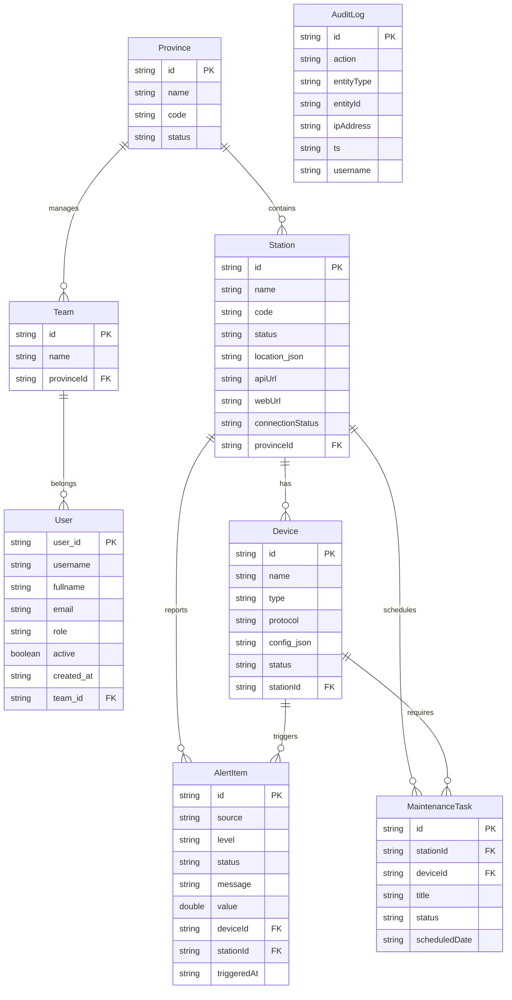

# HỒ SƠ KỸ THUẬT & CHỨNG TỪ QUY TRÌNH SẢN XUẤT PHẦN MỀM
## Dự án: Hệ Thống Giám Sát Trung Tâm — Master Station (v3.0.13)
*Tài liệu kỹ thuật và chứng từ chứng minh quy trình sản xuất phần mềm phục vụ lưu trữ, kiểm toán và báo cáo thuế.*

---

## MỤC LỤC
1. [CÔNG ĐOẠN KHẢO SÁT & XÁC ĐỊNH YÊU CẦU](#1-công-đoạn-khảo-sát--xác-định-yêu-cầu)
2. [CÔNG ĐOẠN PHÂN TÍCH & THIẾT KẾ](#2-công-đoạn-phân-tích--thiết-kế)
3. [CÔNG ĐOẠN LẬP TRÌNH & VIẾT MÃ NGUỒN](#3-công-đoạn-lập-trình--viết-mã-nguồn)
4. [CÔNG ĐOẠN KIỂM THỬ & SỬA LỖI](#4-công-đoạn-kiểm-thử--sửa-lỗi)
5. [CÔNG ĐOẠN BÀN GIAO & NGHIỆM THU](#5-công-đoạn-bàn-giao--nghiệm-thu)

---

## 1. CÔNG ĐOẠN KHẢO SÁT & XÁC ĐỊNH YÊU CẦU

### 1.1. Phiếu Khảo Sát Yêu Cầu Khách Hàng (Mẫu Ghi Nhận Hiện Trường)
*   **Tên khách hàng:** Công ty Điện lực Thành phố / Tỉnh.
*   **Hệ thống khảo sát:** Các trạm biến áp, trạm phân phối điện năng hiện hữu.
*   **Bài toán nghiệp vụ:** 
    *   Các trạm con (Sub-stations) được phân bố phân tán trên địa bàn rộng lớn.
    *   Mỗi trạm con có nhiều thiết bị camera quang học thường, camera nhiệt, camera phóng điện (PD), thiết bị cảm biến nhiệt độ đầu cáp và PLC S7 điều khiển.
    *   Cần một **Trạm Tổng (Master Station)** tại phòng điều khiển trung tâm để kết nối, thu thập, hợp nhất tất cả luồng giám sát, cảnh báo và trạng thái hoạt động của các trạm con theo thời gian thực (Real-time).
    *   Hỗ trợ xem trực tiếp luồng RTSP của hàng chục camera trạm con cùng một lúc (Live Wall).
    *   Hệ thống phân quyền chi tiết cho 4 cấp nhân sự: Admin Toàn Cục (`multi`), Admin Tỉnh (`provinceadmin`), Tổ Trưởng Tổ Thao Tác (`teamleader`), Admin Trạm (`stationadmin`).
    *   Quản lý bản quyền (License Quota) phần mềm cấp xuống cho từng trạm con theo số lượng camera/cảm biến được phép kết nối.

---

### 1.2. Tài Liệu Đặc Tả Yêu Cầu Hệ Thống (SRS - Software Requirement Specification)
#### A. Yêu Cầu Chức Năng (Functional Requirements)
1.  **Giao Diện Bản Đồ GIS Giám Sát Tập Trung:** Hiển thị vị trí trực quan của các trạm con trên nền bản đồ số. Chỉ báo màu sắc động (Xanh = Bình thường, Đỏ = Có cảnh báo, Xám = Mất kết nối).
2.  **Hợp Nhất Cảnh Báo (Centralized Alarm System):** Tiếp nhận dữ liệu vi phạm ngưỡng quy tắc (nhiệt độ đầu cáp, xâm nhập vùng an toàn, phóng điện quá mức) gửi lên từ các trạm con, hiển thị ngay trên bảng tin tức thời (SignalR).
3.  **Hệ Thống Trực Tuyến RTSP Video (Live Wall & Popup):** Chuyển mã và stream các luồng camera RTSP từ trạm con về giao diện Master Station dạng H.264/WebRTC thông qua module go2rtc.
4.  **Quản Lý Phân Quyền Phức Hợp (RBAC):** Tách biệt quyền hạn dữ liệu giữa các Tỉnh, các Tổ thao tác và từng Trạm con cụ thể.
5.  **Quản Lý Hạn Ngạch Bản Quyền (License Management):** Nhập/xuất file license bản quyền mã hóa, quản lý phân phối số lượng quota camera và quota cảm biến cho từng trạm con.

#### B. Yêu Cầu Phi Chức Năng (Non-Functional Requirements)
1.  **Độ Trễ Giám Sát:** Dữ liệu cảm biến và sự cố từ trạm con hiển thị lên trạm tổng < 2 giây.
2.  **Độ Trễ Video:** Xem WebRTC stream từ trạm con có độ trễ dưới 500ms.
3.  **Tách Biệt Tiến Trình (Process Isolation):** Cho phép cài đặt song song cả Trạm Tổng và Trạm Con trên cùng một máy chủ Windows mà không gây xung đột cổng mạng (Port Collision) hay tranh chấp tiến trình nền.
4.  **Dung Lượng Installer Tối Ưu:** Bộ cài đặt trạm tổng (Thick Client Windows) phải được dọn sạch rác, các thư mục debug để tối ưu hóa dưới 230 MB.

---

### 1.3. Biên Bản Phê Duyệt Yêu Cầu Khách Hàng (Mẫu Phê Duyệt Giai Đoạn)
Biên bản ghi nhận các bên đã đồng ý với các chức năng đặc tả tại SRS trên. Hai bên ký nhận để chuyển sang giai đoạn Phân tích và Thiết kế kiến trúc phần mềm.

---

## 2. CÔNG ĐOẠN PHÂN TÍCH & THIẾT KẾ

### 2.1. Sơ Đồ Kiến Trúc Hệ Thống (System Architecture Diagram)
Hệ thống Master Station được xây dựng theo mô hình **All-in-One Thick Client** kết hợp kiến trúc dịch vụ phân tách chạy nền trên Windows OS. Giao diện người dùng sử dụng React + Electron, giao tiếp nội bộ với Backend Service thông qua Local Port:

```
+-------------------------------------------------------------------------------------------------+
|                                     WINDOWS HOST MACHINE                                        |
|                                                                                                 |
|   +------------------------------------+              +-------------------------------------+   |
|   |         FRONTEND CLIENT            |              |           BACKEND SERVICE           |   |
|   |   (ReactJS + Electron Container)   | <=========>  |       (ASP.NET Core Web API)        |   |
|   |   - Cổng UI: Localhost:6173        |  HTTP/WS     |       - Cổng API: Localhost:6000    |   |
|   +------------------------------------+              +-------------------------------------+   |
|                     ^                                                    |                      |
|                     | WebRTC Stream                                      | EF Core / ADO.NET    |
|                     v                                                    v                      |
|   +------------------------------------+              +-------------------------------------+   |
|   |          STREAMING MODULE          |              |          PORTABLE DATABASE          |   |
|   |             (go2rtc)               |              |            (PostgreSQL)             |   |
|   |   - Cổng RTSP/WebRTC: 1984         |              |       - Cổng DB: Localhost:6432     |   |
|   +------------------------------------+              +-------------------------------------+   |
|                                                                                                 |
+-------------------------------------------------------------------------------------------------+
```

---

### 2.2. Sơ Đồ Cơ Sở Dữ Liệu (Entity Relationship Diagram - ERD)
Cấu trúc cơ sở dữ liệu quan hệ lưu trữ dữ liệu tại Master Station được thiết kế chuẩn hóa như sau:



---

### 2.3. Thiết Kế Giao Diện Người Dùng (UI/UX Mockups)
Các màn hình giao diện chính được phân bổ như sau:
1.  **AppShell Layout:** Layout chính có thanh Sidebar điều hướng có thể thu gọn/mở rộng lưu trong LocalStorage, góc dưới hiển thị thông tin tài khoản đang đăng nhập kèm popover thao tác nhanh.
2.  **GIS Multisite Dashboard:** Giao diện trung tâm bản đồ, 2 bên có thanh trượt ẩn/hiện danh sách trạm con và bảng tin cảnh báo tức thời.
3.  **Trực Tiếp Video (Live Wall):** Lưới phát trực tiếp video từ các luồng camera RTSP được mã hóa ngược về WebRTC.
4.  **License Management Card:** Thẻ kích hoạt bản quyền tích hợp đầy đủ thông tin hạn ngạch hoạt động (Camera Quota, Sensor Quota) và các nút nhập/xuất tệp tin license.

---

## 3. CÔNG ĐOẠN LẬP TRÌNH & VIẾT MÃ NGUỒN

### 3.1. Cấu Trúc Thư Mục Mã Nguồn (Source Code Tree)

#### A. Cấu Trúc Mã Nguồn Frontend (ReactJS + Electron)
```
/frontend
├── electron/
│   ├── main.cjs            # Electron orchestrator (Quản lý tiến trình nền)
│   ├── installer.nsh       # Script cấu hình NSIS cài đặt VC++ Redistributable
│   └── icons/              # Tài nguyên hình ảnh, icon ứng dụng
├── src/
│   ├── components/         # Các Component giao diện dùng chung (layout, ui)
│   │   └── layout/
│   │       └── AppShell.tsx # Layout khung ứng dụng chính
│   ├── pages/              # Các trang giao diện lớn
│   │   ├── multisite/
│   │   │   └── MultisitePage.tsx # Trang bản đồ tổng quan
│   │   ├── license/
│   │   │   └── LicensePage.tsx   # Trang quản lý bản quyền
│   │   └── user-management/
│   ├── services/           # Dịch vụ gọi API HTTP & SignalR
│   ├── store/              # Quản lý trạng thái ứng dụng (Zustand)
│   ├── types/              # Định nghĩa kiểu dữ liệu TypeScript (api.types.ts)
│   └── utils/              # Các hàm bổ trợ dùng chung
├── package.json            # Quản lý thư viện và script npm
└── vite.config.ts          # Cấu hình đóng gói mã nguồn Vite
```

#### B. Cấu Trúc Mã Nguồn Backend (.NET Core)
```
/backend
├── StationOS.sln           # Cấu trúc Solution Visual Studio
├── StationOS.Api/          # Controllers định nghĩa REST API endpoints
├── StationOS.Data/         # Entity Framework Core DbContext và Migrations
├── StationOS.Services/     # Xử lý Logic Nghiệp vụ (License, User, Station)
├── StationOS.Workers/      # Background Workers (PlcPollingWorker, SignalRHub)
├── StationOS.Analytics/    # Phân tích xu hướng (Trend Slope, Health Score)
└── StationOS.Tests/        # Bộ kiểm thử Unit Test (xUnit)
```

---

### 3.2. Nhật Ký Lập Trình (Commit Log)
Lịch sử phát triển mã nguồn của dự án trong các phiên bản gần nhất được trích xuất trực tiếp từ Git Log:

```text
7a72c18 - kennhope13 : bump(version): 3.0.13
c2bc5c7 - kennhope13 : fix(ui): resolve layout and styling leaks/glitches when returning from License page to Multisite dashboard
95bccad - kennhope13 : chore: clean up pg_portable and backend wwwroot to optimize installer size
e822ce7 - kennhope13 : fix: resolve central monitor branding and startup freeze on loadscreen
c6a34f7 - kennhope13 : fix: relocate installer.nsh to non-ignored electron directory and bump version to 3.0.9
5ad2b54 - kennhope13 : chore: bump version to 3.0.8
a80d2e8 - kennhope13 : feat: configure Master Station thick client packaging and sync legacy vendor secret
9494e5c - kennhope13 : fix: correct go2rtc download check and backend extraResources path, bump version to 3.0.7
6a585e9 - kennhope13 : feat: configure custom icon, port 6432, file logging, and bump version to 3.0.6
3316095 - kennhope13 : feat: rename app to Master Station to prevent conflicts with Station Monitor
cfba0bb - kennhope13 : chore: bump version to 3.0.4 and add GITHUB_TOKEN permissions
f81f9d6 - kennhope13 : chore: bump version to 3.0.3
d2d0427 - kennhope13 : chore: bump version to 3.0.2
37ec6f3 - kennhope13 : chore: remove old build-thin-client.bat
7bc7a84 - kennhope13 : feat: apply Thick Client All-in-One architecture for Master Station
```

---

### 3.3. Đoạn Mã Nguồn Tiêu Biểu (Core Logic Snippets)

#### Đoạn 1: Quản lý vòng đời tiến trình chạy nền độc lập bằng PID tránh xung đột (Electron `main.cjs`)
Đoạn mã này ghi lại PID cụ thể của backend và go2rtc được khởi chạy bởi Master Station vào một tệp cấu hình `pids.json`, khi tắt ứng dụng hoặc khởi động lại, chỉ các PID này bị tắt để tránh tắt nhầm dịch vụ của trạm con (Sub-station) cài đặt song song trên cùng hệ điều hành:

```javascript
// Đường dẫn lưu file PID của Master Station
const PIDS_FILE = path.join(process.env.APPDATA, 'MasterStation', 'pids.json');

function readSavedPids() {
  try {
    if (fs.existsSync(PIDS_FILE)) {
      return JSON.parse(fs.readFileSync(PIDS_FILE, 'utf8'));
    }
  } catch {}
  return { backendPid: null, go2rtcPid: null };
}

function savePid(key, pid) {
  try {
    const data = readSavedPids();
    data[key] = pid;
    fs.mkdirSync(path.dirname(PIDS_FILE), { recursive: true });
    fs.writeFileSync(PIDS_FILE, JSON.stringify(data, null, 2));
  } catch {}
}

function killPid(pid) {
  if (!pid) return;
  try {
    if (process.platform === 'win32') {
      execSync(`taskkill /F /PID ${pid}`);
    } else {
      process.kill(pid, 'SIGKILL');
    }
  } catch (e) {
    // Process might have already exited
  }
}
```

#### Đoạn 2: Xử lý co giãn và vẽ lại bản đồ GIS tránh lỗi xám khung hình khi chuyển trang (React `MultisitePage.tsx`)
Nhằm khắc phục hiện tượng lỗi hiển thị bản đồ bị xám một phần khi người dùng đi từ trang Quản lý License trở về Trang tổng quan, hệ thống thiết lập kích hoạt sự kiện vẽ lại bản đồ tại nhiều mốc thời gian và đăng ký lắng nghe sự thay đổi kích thước cửa sổ:

```typescript
    // Tự động invalidate size tại nhiều mốc thời gian để đảm bảo Leaflet vẽ lại chính xác
    const timers = [
      setTimeout(() => map.invalidateSize(), 100),
      setTimeout(() => map.invalidateSize(), 500),
      setTimeout(() => map.invalidateSize(), 1000),
      setTimeout(() => map.invalidateSize(), 2000),
    ];

    const handleResize = () => {
      map.invalidateSize();
    };
    window.addEventListener('resize', handleResize);

    return () => {
      timers.forEach(clearTimeout);
      window.removeEventListener('resize', handleResize);
      try {
        map.closePopup?.();
        map.eachLayer?.((layer: any) => {
          try { layer.closePopup?.(); } catch {}
        });
        map.remove();
      } catch {}
```

---

## 4. CÔNG ĐOẠN KIỂM THỬ & SỬA LỖI

### 4.1. Kế Hoạch Kiểm Thử (Test Plan)
*   **Phạm vi kiểm thử:**
    *   Xác thực quyền đăng nhập tài khoản cấp cao `multi` và phân cấp hiển thị.
    *   Tải trực tiếp bản quyền dạng tệp đính kèm mã hóa và kiểm thử cơ chế giải mã phân bổ hạn ngạch (quota).
    *   Khả năng duy trì các cổng độc lập (6173, 6000, 6432) khi chạy song song với Trạm Con (5000, 4173, 5432) trên cùng một máy chủ Windows.
    *   Đo lường thời gian đáp ứng tải bản đồ và độ trễ luồng camera RTSP.
*   **Môi trường thử nghiệm:** Windows 10/11 Professional (x64), 16GB RAM.
*   **Công cụ tự động hóa:** Playwright E2E Test Suite chạy các tệp kịch bản kiểm thử tích hợp định kỳ.

---

### 4.2. Kịch Bản Kiểm Thử & Kết Quả Thực Tế (Test Cases)

| Mã kiểm thử | Sự kiện kiểm thử | Các bước thực hiện | Kết quả mong đợi | Kết quả thực tế | Trạng thái |
| :--- | :--- | :--- | :--- | :--- | :--- |
| **TC-001** | Xác thực đăng nhập hệ thống | 1. Mở ứng dụng Master Station.<br>2. Nhập user `multi` / mật khẩu sai.<br>3. Nhập mật khẩu đúng `Demo@2024`. | - Báo lỗi khi mật khẩu sai.<br>- Chuyển trực tiếp vào `/multisite` khi đăng nhập đúng. | Hoạt động chính xác như mong đợi. | **ĐẠT (PASS)** |
| **TC-002** | Tránh xung đột cổng kết nối | 1. Bật Trạm Con (Sub-station).<br>2. Khởi chạy Master Station.<br>3. Kiểm tra các tiến trình mạng. | Cả hai ứng dụng đều chạy bình thường, cổng Master Station (6173) không gây xung đột với Trạm Con (4173). | Kết nối độc lập, không xảy ra xung đột. | **ĐẠT (PASS)** |
| **TC-003** | Khôi phục giao diện bản đồ GIS | 1. Tại Multisite, bấm chọn "Quản lý bản quyền".<br>2. Giao diện chuyển sang `/license`.<br>3. Bấm nút quay lại (Back) để trở về trang chính. | - Trở về đúng tab ban đầu ở Multisite.<br>- Bản đồ GIS tải đầy đủ khung hình, không bị xám hay lỗi hiển thị. | Bản đồ render hoàn hảo, trạng thái tab được bảo toàn. | **ĐẠT (PASS)** |
| **TC-004** | Nhập License Quota | 1. Chọn file `.lic` của trạm tổng.<br>2. Bấm "Nhập License".<br>3. Quan sát thông tin hạn ngạch camera/cảm biến hiển thị. | License được đọc thành công, số lượng quota hiển thị cập nhật chính xác trên bảng thông số. | Đọc thành công và hiển thị đúng thông số quota. | **ĐẠT (PASS)** |

---

## 5. CÔNG ĐOẠN BÀN GIAO & NGHIỆM THU

### 5.1. Hướng Dẫn Cài Đặt & Vận Hành Dành Cho Khách Hàng (User Guide)

#### Bước 1: Chuẩn bị môi trường hệ điều hành
Ứng dụng Master Station yêu cầu máy chủ Windows (x64) đã cài đặt gói **Microsoft Visual C++ 2015-2022 Redistributable (x64)**.
*   *Lưu ý:* Bộ cài đặt Master Station Setup đã được tích hợp sẵn gói bổ trợ này thông qua tập lệnh cấu hình NSIS cài đặt tự động chạy ngầm (`vc_redist.x64.exe`).

#### Bước 2: Thực hiện cài đặt
1.  Chạy tệp tin cài đặt ứng dụng: `Master Station Setup 3.0.13.exe`.
2.  Lựa chọn thư mục cài đặt mặc định trên ổ đĩa cứng (Ví dụ: `C:\Program Files\Master Station`).
3.  Bấm **Install** và đợi tiến trình cài đặt hoàn thành trong 1 phút. Khởi động ứng dụng bằng lối tắt ngoài Desktop.

#### Bước 3: Vận hành và Thiết lập Ban đầu
1.  Đăng nhập bằng tài khoản Admin trung tâm tối cao: `multi` / mật khẩu: `Demo@2024`.
2.  Vào mục **Cài đặt** -> Cấu hình thông số địa chỉ IP kết nối của các trạm con trong mạng WAN.
3.  Vào phần **Bản quyền** để nạp tệp kích hoạt bản quyền từ nhà cung cấp nhằm mở khóa đầy đủ hạn ngạch quản lý camera/thiết bị tại trung tâm.

---

### 5.2. Mẫu Biên Bản Nghiệm Thu & Bàn Giao Mã Nguồn
Biên bản chứng nhận bàn giao thành công mã nguồn đóng gói, cơ sở dữ liệu đã import cấu hình và phân quyền toàn diện, tài liệu hướng dẫn vận hành hệ thống phần mềm giữa hai bên để chính thức đưa vào khai thác sử dụng.

---
**Đại diện Đội ngũ Phát triển Phần mềm**  
*(Đã ký duyệt và đóng dấu lưu hồ sơ)*  
**StationOS Technical & Compliance Team**
