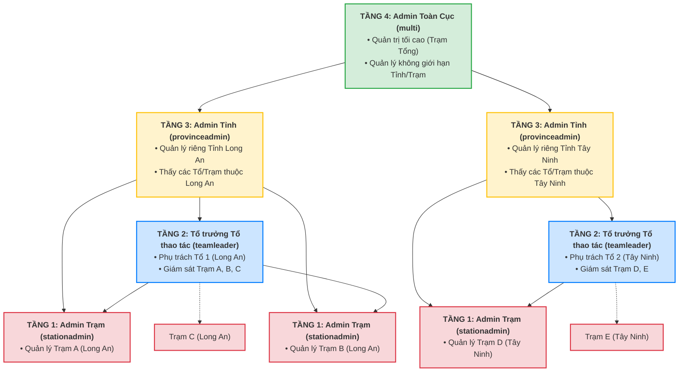

# BẢNG THỐNG KÊ PHÂN QUYỀN HỆ THỐNG (RBAC) - STATIONOS

Tài liệu này tổng hợp chi tiết các **Vai trò (Role)**, **Tài khoản mẫu (Username & Mật khẩu mặc định)**, và **Kiến trúc phân cấp** tương ứng trong hệ thống StationOS hiện tại.

---

## 1. Sơ Đồ Kiến Trúc Phân Cấp Phân Quyền (4 Tầng Quản Trị)

Dưới đây là mô hình phân cấp quản trị từ cấp cao nhất (Trạm Tổng) đến cấp cơ sở (Trạm Con):

---

## 2. Bảng Phân Quyền Chi Tiết (4 Cấp Quản Trị Hệ Thống)

Hệ thống được thiết lập tinh gọn gồm **4 cấp tài khoản quản trị mặc định** tương ứng với 4 tầng quản lý hành chính hình cây:

| STT | Cấp quản lý | Tài khoản mẫu (Username) | Mật khẩu mặc định | Phạm vi quản lý (Scope) | Quyền hạn chính (Permissions) |
| :--- | :--- | :--- | :--- | :--- | :--- |
| **1** | **Admin Toàn Cục** *(Tầng 4 - Quản trị tối cao)* | `multi` | `Demo@2024` | **Toàn bộ hệ thống** (Không giới hạn Tỉnh/Trạm) | **Full Quyền**: Có toàn bộ tất cả các quyền của hệ thống (Quản lý trạm, thiết bị, luật cảnh báo, cấu hình, bản quyền, người dùng, báo cáo,...). |
| **2** | **Admin Tỉnh** *(Tầng 3 - Quản trị cấp Tỉnh)* | `provinceadmin` | `Province@123` | Chỉ được phép thao tác trong **Tỉnh được gán** | **Quyền quản trị Tỉnh**: Thêm/sửa/xóa Trạm, Thiết bị, Luật cảnh báo, Người dùng (nhân sự cấp dưới), Tổ thao tác lưu động và Bản quyền thuộc tỉnh đó. |
| **3** | **Tổ trưởng Tổ thao tác** *(Tầng 2 - Quản trị cấp Tổ)* | `teamleader` | `TeamLeader@123` | Các trạm do **Tổ thao tác phụ trách** | Giám sát trạm, điều khiển thiết bị tại hiện trường khi đi xử lý sự cố, xem luật và xem báo cáo sự cố. |
| **4** | **Admin Trạm** *(Tầng 1 - Quản trị cấp Trạm con)* | `stationadmin` | `Station@123` | Chỉ được phép thao tác trong **Trạm được gán** | **Quyền quản trị Trạm**: Quản lý thiết bị, cấu hình luật cảnh báo, báo cáo và gán nhân sự trực thuộc trạm đó. |

---

## 3. Các Quy Tắc Bảo Mật Đặc Biệt Trong Mã Nguồn

* **Tách biệt an toàn Trạm Tổng & Trạm Con**: 
  * Tài khoản `admin` (mật khẩu `Admin@123`) **chỉ tồn tại và được phép hoạt động trên Trạm Con** để phục vụ việc trạm tổng kết nối API lấy luồng camera, chỉ số đo đạc.
  * Trên **Trạm Tổng (Master Station)**, tài khoản `admin` này đã được **xóa hoàn toàn khỏi cơ sở dữ liệu** để bảo mật tuyệt đối. Trạm Tổng chỉ chấp nhận tài khoản quản trị tối cao duy nhất là **`multi`** (mật khẩu `Demo@2024`).
* **Bảo vệ tài khoản tối cao**: Đối với các tài khoản Admin mặc định hệ thống (`admin`, `multi`, `provinceadmin`, `stationadmin`, `teamleader`), giao diện sẽ ẩn hoàn toàn các nút hành động (Sửa, Đổi mật khẩu, Vô hiệu hóa) để ngăn ngừa trường hợp người quản trị vô tình tự khóa tài khoản hoặc xóa tài khoản tối cao.
* **Tự động lọc Realtime**: Khi một Admin thực hiện thay đổi thông tin tài khoản hoặc Tổ thao tác, hệ thống sẽ tự động gửi thông báo qua WebSocket (SignalR) để tất cả các phiên làm việc của người dùng khác được cập nhật tức thì mà không cần F5 tải lại trang.
